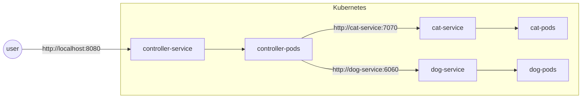

# Kubernetes Cat Dog Example

This project contains an example of multiple services deployed in Kubernetes. Furthermore, the project shows how one service can call others even when multiple replicas are deployed. I made this project while learning how to use Kubernetes and thought that others might gain something from this example. 

The example contains three services, a cat that says "meow", a dog that says "woof" and a controller that presents what both a cat and a dog says.

# The setup


# How to run

## Requirements
- Docker
- Kubernetes and kubectl

## Starting one service manually

Each service has to be deployed independently, every service contains a docker, deployment and service file.  To deploy a service these commands can be called:
```
Docker build <path_to_directory> --tag <label_name>
kubectl apply -f <path_to_deployment_yaml_file>
kubeclt apply -f <path_to_service_yaml_file>
```

To stop the service again these two calls can be used.
```
kubectl delete deployment <deployment_name>
kubectl delete service <service_name>
```

## Starting services with powershell script
To keep the amount of manual work down i wrote two small scripts,  one to deploy a service and one to stop it. I would recommend trying it manually before using these scripts.

With the "StartService" script all three services can be deployed as such:
```
.\StartService.ps1 .\cat-service\ cat
.\StartService.ps1 .\dog-service\ dog
.\StartService.ps1 .\controller\ controller
```

Likewise with the "StopService" script all three services can be stopped as such:
```
.\StopService.ps1 cat
.\StopService.ps1 dog
.\StopService.ps1 controller
```
